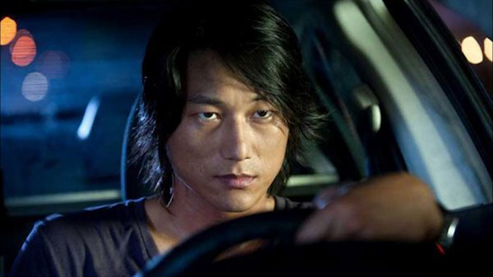

# Small Task 8 - Streets of Tokio

In this assignment your task is to write simulations for car races using async and the Tokio runtime.

A race happens inside a city, represented by a rectangular `n x m` grid with `n * m` major intersections. Intersections can contain traffic lights, which for the purposes of this task can only be in two states - either green or red. All lights have an associated duration in milliseconds after which they periodically change their color.

Any number of cars can participate in a race. Each car has a name and a path composed of intersection coordinates. Every time a car approaches an intersection that has traffic lights and those lights are currently red, the car has to wait until the lights turn green. If no lights are present at an intersection or the lights are green, the car can drive past freely. A car finishes the race when it drives past the last intersection on its path.

The `race(city, cars)` function from `main.rs` should start the race and the traffic lights and wait until the race is finished, returning a list of car names in order of the race's completion. Remember, this is supposed to be a simulation. You should not be calculating the cars' order beforehand. You should only be using Rust's and Tokio's async features.

The `FuturesUnordered` object from the `futures` crate might be useful for this assignment.